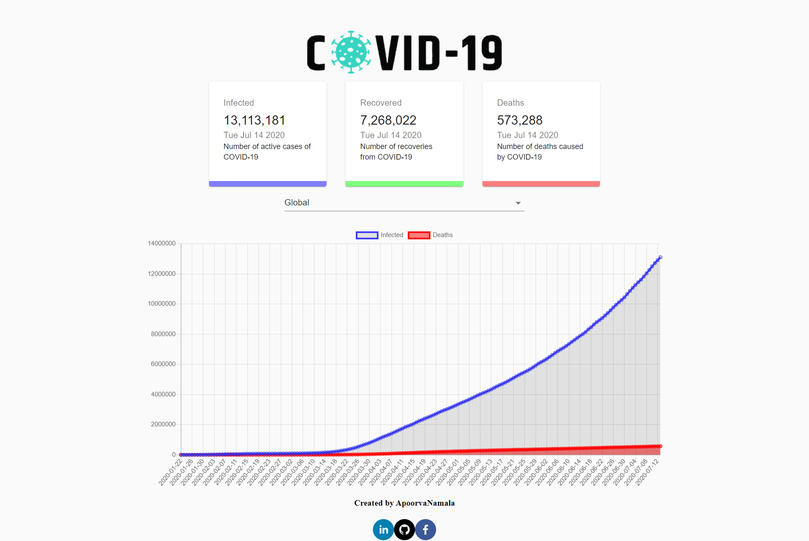

## COVID-19 Tracker

A web application to represent the data of COVID-19  build with React, Chart.JS and Material UI.

This is motivated and learned from [Javascript Mastery](https://www.youtube.com/watch?v=khJlrj3Y6Ls).

## Tech Stack
- HTML5, CSS3, Javascript, ReactJS, React Hooks, Chart.JS, Material UI
- API used: https://covid19.mathdro.id/api

## Screenshot of the Web App

## Getting Started
- Fork and clone this repository.
- Run `npm i && npm start`

## Project Admin

 **[Apoorva Namala](https://www.linkedin.com/in/sri-lakshmi-apoorva-namala-223910188/)** 
